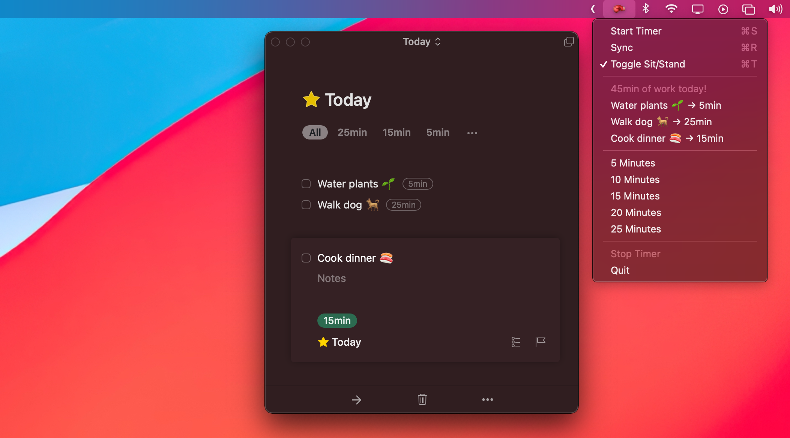

# Timebox – macOS Menubar App

Menu bar utility app (macOS) for adding [Timeboxing](https://en.wikipedia.org/wiki/Timeboxing) and [Pomodoro](https://en.wikipedia.org/wiki/Pomodoro_Technique) workflow support to [Things 3](https://culturedcode.com/things/).



See `Makefile` for how to install, debug, build, and release. Or download the [latest release](https://github.com/visini/timebox/releases).

Note: Since April 14, 2023, Things 3 stores data in a unique location - you will have to build the app after setting the proper path in `main.py` via `THINGS_SQLITE_PATH`.

Download using GitHub CLI:

```shell
gh release -R visini/timebox download -D ~/Downloads -p "*.app.zip"
```

Note: If you can't open `Timebox.app`, you could try running `xattr -cr Timebox.app`.

---

See also:

- [mk1123/timebox](https://github.com/mk1123/timebox)
- [visini/pomodoro](https://github.com/visini/pomodoro)
